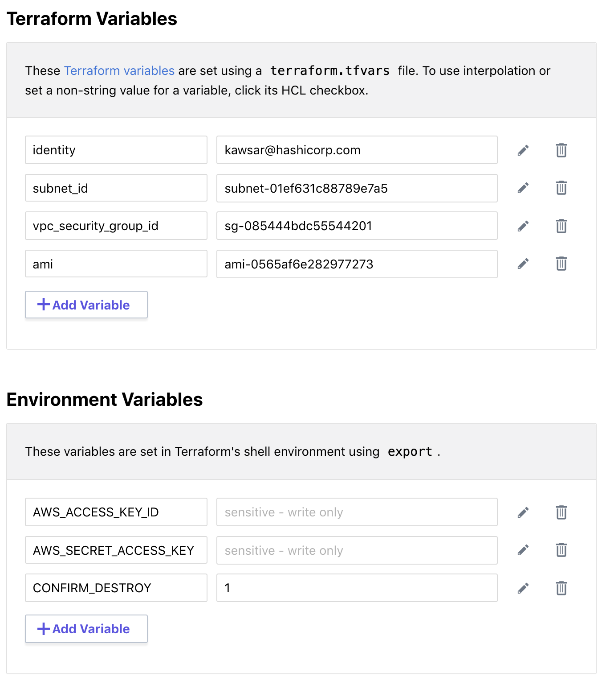
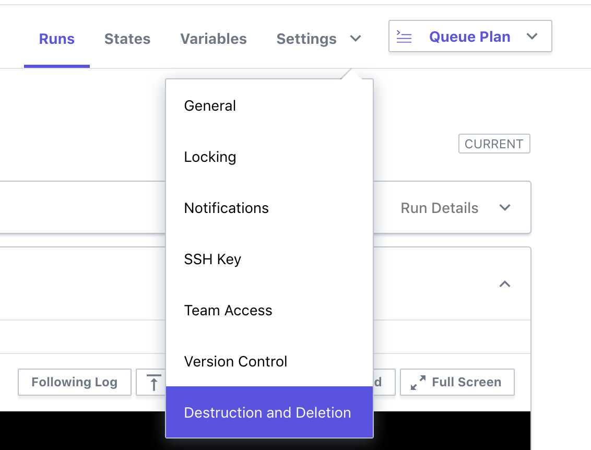

## Getting Started with Terraform Enterprise

Duration: 30 minutes

This lab demonstrates the Terraform Enterprise [UI-driven run workflow](https://www.terraform.io/docs/enterprise/run/ui.html).

This lab is intended to run on Terraform Enterprise, however, it an also be run locally, see [local.md](local.md) for steps.

The Terraform configuration in this directory will provision one or more AWS EC2 instances and deploy an example Go application. To install the application, Terraform will generate a RSA SSH public and private key pair by Terraform using the Terraform [tls_private_key](https://www.terraform.io/docs/providers/tls/r/private_key.html) provider.

**Tasks:**
- Task 1: Create a Workspace in Terraform Enterprise
- Task 2: Configure Variables
- Task 3: Queue a Plan
- Task 4: Confirm and Apply the Plan
- Task 5: Scale the application using a UI workflow
- Task 6: Destroy provisioned infrastructure

### Terraform Enterprise

- **Pre-requisites:** These will be provided for HashiCorp training students.
  - An AWS account with IAM user credentials: `AWS_ACCESS_KEY_ID` and `AWS_SECRET_ACCESS_KEY`.
  - A previously created AWS Security Group and AWS Subnet ID.
  - Access to a Terraform Enterprise Server. This Lab will use the hosted SaaS version on [app.terraform.io](https://app.terraform.io).

### Task 1: Create a workspace in TFE

- Please go to [app.terraform.io](https://app.terraform.io), select the organization for this lab, then click the "+ New Workspace" button at the top right.
  - Note: HashiCorp training students will be added to a training organization

- Give the workspace unique name such as "<yourname>-training-lab01".

- Under "SOURCE", choose the GitHub button.
- Click the "Repository" text-field and you’ll see a list of available repositories in an auto-complete menu. Enter `kawsark/aws-terraform-workshop` as the repository name.

<table><tr><td>

</td></tr></table>

- Click the "More options (working directory, VCS branch, ingress submodules)" link and specify the values below:
  - **TERRAFORM WORKING DIRECTORY:** `lab01`. By default Terraform will use repository root directory but in this case we will with the lab01 subdirectory.
  - **VCS BRANCH:**: leave empty or `master`. Terraform Enterprise can deploy from any branch.

<table><tr><td>

</td></tr></table>

- Click on the "Create Workspace" button.

You’ll see a screen showing that a Terraform Enterprise workspace is connected to a GitHub repository. But we still need to provide our AWS credentials and values for Terraform variables.

## Task 2: Configure variables

Go to the "Variables" tab on the top right.  On the variables page, you'll see there are two kinds of variables:

- Terraform Variables: these are compiled into a `terraform.tfvars` file.
- Environment Variables: these are populated in the runtime environment where terraform plan and terraform apply executes.

### Step 2.2: Enter Terraform Variables

In the "Terraform Variables" section, click "Add Variable" and add the following variable:
- Key `identity`, value: `<your username or email>`. Click on "Save Variable".

Please repeat for the following 3 variables:
**Note:** For HashiCorp training students, please issue the following command in your workstation to find the appropriate values: `cat /workstation/terraform/terraform.tfvars`

- Key `subnet_id`, value: `<pre-created-subnet-id>`
- Key `vpc_security_group_id`, value: `<pre-created-security-group-id>`
- Key `ami`, value: `<pre-created-ami>`

### Step 2.3: Enter AWS Credentials as Environment Variables

In the "Terraform Variables" section, click "Add Variable" and add the following 2 variables:
**Note:** For HashiCorp training students, please issue the following command in your workstation to find the appropriate values: `cat /workstation/terraform/terraform.tfvars`

- Key `AWS_ACCESS_KEY_ID`, value: `your_aws_access_key_id`.  
  - Click on the "Sensitive" checkbox to make it a write-only variable.  
  - Click on "Save Variable".  

  Please repeat for the secret key:
- Key `AWS_SECRET_ACCESS_KEY`, value: `your_secret_access_key`.

Finally, please add one more environment variable which will relevant for a later step:
- Key `CONFIRM_DESTROY`, value: `1`.

Below is an example screenshot (your values will be different):
<table><tr><td>

</td></tr></table>

## Task 3: Queue a Plan

For this task, you'll queue a `terraform plan` in Terraform Enterprise.

### Step 3.1: Queue a plan and read the output

- Click the "Queue Plan" drown down menu at the top right, enter a reason such as "lab", then click "Queue Plan"

- Go to the "Runs" tab, or "Latest Run". Find the most recent one (there will probably be only one).

- Scroll down to where it shows the plan. Click the button to "View Plan." You’ll see the same kind of output that you are used to seeing on the command line.

- After a few seconds, you'll see that Terraform Enterprise checked the plan and that it passed.

## Task 4: Confirm and Apply the Plan

### Step 4.1: Confirm and `apply`

- Scroll to the bottom of the run and confirm the `plan`. At the bottom of the page you’ll see a place to comment (optional) and click "Confirm & Apply."

<table><tr><td>

</td></tr></table>

- This will queue a `terraform apply` in Terraform Enterprise.

- Examine the output of `terraform apply` and find the IP address of the new instance. The output looks like what you’ve previously seen in the terminal. Copy the `public_ip` address and paste it into your browser. You'll see the running web application.

<table><tr><td>

</td></tr></table>

## Task 5: Scale the qty. of servers.

### Step 5.1: Create or update the num_webs variable

In this step we will scale this deployment by modifying the `num_webs` variable:
- Define a `num_webs` Terraform variable and set the qty. to 2.

### Step 5.2: Queue a new plan and proceed with Apply.
- Queue a new plan (e.g. step 3.1) and examine the output.
- Apply the plan (e.g. step 4.1) and examine the output.

## Task 6: Destroy

To destroy the infrastructure we've just created we will need to queue a destroy plan.

### Step 6.1: Configure CONFIRM_DESTROY variable

- You'll need to create an environment variable (not a Terraform variable) named `CONFIRM_DESTROY` and set it to `1`. This should have been done in step 2.3. If you missed that, please go to the "Variables" tab and do that now. If you already defined this variable you can skip this step.

### Step 6.2: Queue destroy plan

- Click on the "Settings" dropdown, and choose "Destruction and Deletion"
- Click "Queue Destroy Plan" button; note the messages under "Plan" that indicate that it will destroy several resources.

<table><tr><td>

</td></tr></table>

- Click "Confirm and Apply." After a few minutes, your infrastructure will be destroyed as requested.
