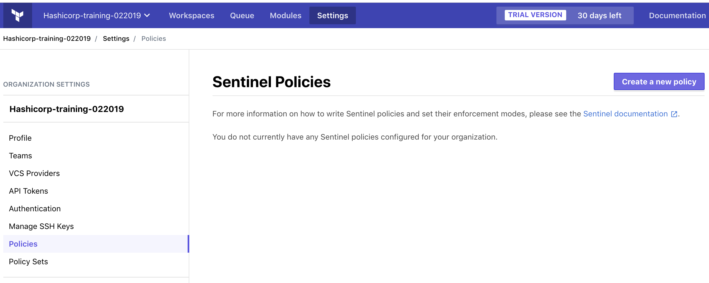
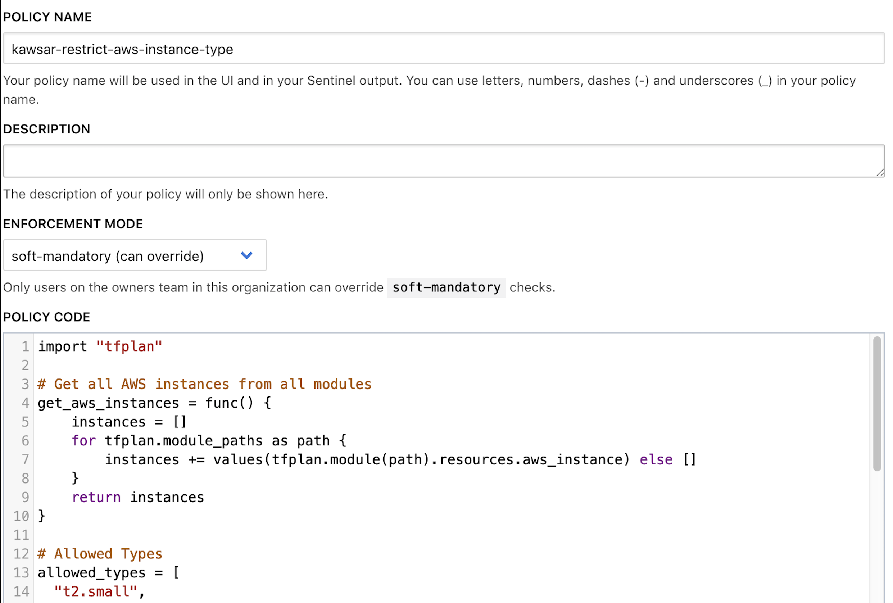
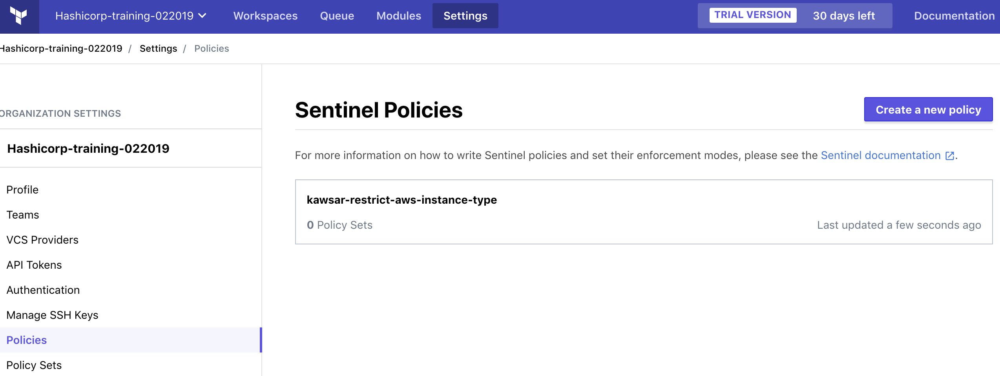
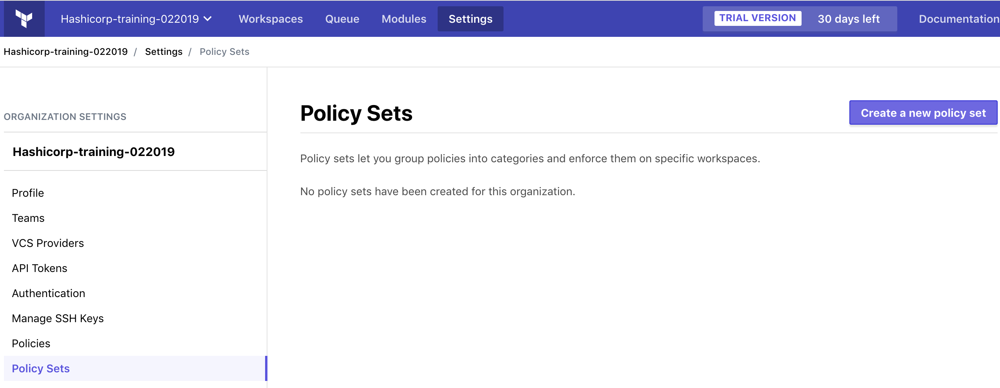
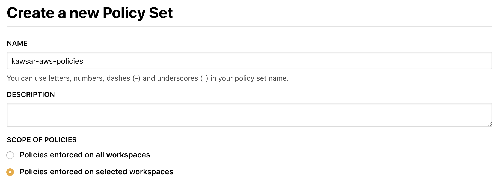
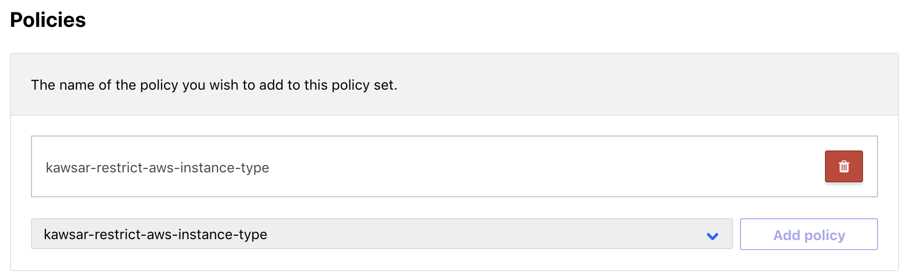
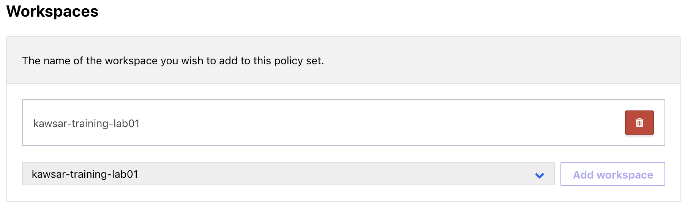
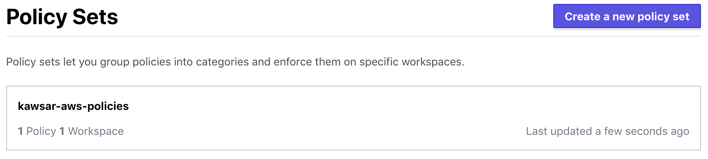
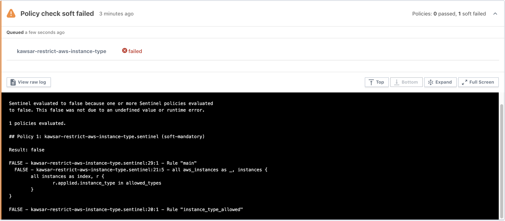

### Lab03 - Sentinel Policy as Code

Duration: 20 minutes

In this Lab we will continue to use the Organization as lab01. Using Sentinel policy-as-code framework we will restrict the AWS EC2 instance type being deployed.
- The Sentinel policy code is included in lab03 directory: [restrict-aws-instance-type.sentinel](restrict-aws-instance-type.sentinel).
- You can view other [example Sentinel policies on AWS](https://github.com/hashicorp/terraform-guides/tree/master/governance/aws) in terraform-guides repo.

**Tasks:**
- Task 1: Create a Sentinel policy
- Task 2: Create a Policy Set
- Task 2: Queue a Plan
- Task 3: View Sentinel policy failure and Override
- Task 4: Destroy provisioned infrastructure

### Terraform Enterprise

### Task 1: Create Sentinel policy
- Go to your Organization URL: `https://app.terraform.io/app/<your-organization-name>`
- Click on Settings at the top purple bar
- Click on "Policies" from the Organization Settings menu on the left

<table><tr><td></td></tr></table>

- Click "Create a new policy" button:
  - Set "POLICY NAME" to something descriptive *with your name prepended*. E.g: `kawsar-restrict-aws-instance-type`.
  - Set "ENFORCEMENT MODE" to soft-mandatory (can override)
  - In "POLICY CODE", add the contents of [restrict-aws-instance-type.sentinel](restrict-aws-instance-type.sentinel).

<table><tr><td></td></tr></table>

- _Optional: Browse [example Sentinel policies on AWS](https://github.com/hashicorp/terraform-guides/tree/master/governance/aws) in terraform-guides repo and add additional policies if you would like to try any of them out. Please remember to prepend policy name with your name._

- Leave the "Policy Sets" section empty.
- Finally, please click "Create policy" and you should see your policy listed in this organization:  

<table><tr><td></td></tr></table>

### Task 2: Create a Policy Set
Policy Sets allow us to group policies and target them to be applied against a desired set of workspaces. Use the steps below to create a new Policy set:
- Go to your Organization URL, which is in the format: `https://app.terraform.io/app/<your-organization-name>`
- Click on Settings at the top
- Click on "Policy Sets" from the Organization Settings menu on the left:  

<table><tr><td></td></tr></table>

- Click on "Create a new Policy Set"
  - Set "NAME" to something descriptive *with your name prepended*. E.g: `kawsar-aws-policies`.
  - Choose "SCOPE OF POLICIES" to be "Policies enforced on selected workspaces"

<table><tr><td></td></tr></table>  

- Under "Policies" please choose the policy you created under Task 1 "restrict-aws-instance-type" and click "Add policy".
- Make sure your policy is listed before proceeding to next step as below:

<table><tr><td></td></tr></table>  

- Under "Workspaces", select your own Workspace from the drop-down menu and click "Add Workspace".
- Make sure your workspace is added before proceeding to next step as below:

<table><tr><td></td></tr></table>  

- Finally, please click "Create Policy Set" to save the policy. You should see your policy set listed with 1 Workspace and 1 Policy (or more if you mapped additional policies).

<table><tr><td></td></tr></table>  

### Task 2: Queue a plan

**Steps:**
- Click on "Workspaces" from the top, and click on the Workspace you used for lab01.
- Click the "Queue Plan" drown down menu at the top right, enter a reason such as "sentinel test", then click "Queue Plan"

Go to the "Runs" tab, or "Latest Run". Find the most recent one.

### Task 3: View Sentinel policy failure and Override

**Steps:**
- The Run should show a Policy failure: "Policy check soft failed"

<table><tr><td></td></tr></table>  

- Lets understand why this policy has failed. View the `allowed_types` array in Sentinel Policy code [restrict-aws-instance-type.sentinel](restrict-aws-instance-type.sentinel). You will see that the `allowed_types` array only lists `t2.small` instances.
- The server module [main.tf](../lab01/server/main.tf) is using an `instance_type` of `t2.medium` which is causing the Policy to fail.
- Since you are the owner of the Organization, you are able to Override this Policy failure.
  - Click on "Override & Continue" button Optionally adding some comments.
  - Click on "Confirm and Apply" button to allow the Run to complete.
- The Apply should go through successfully at this time.

### Task 4: Destroy provisioned infrastructure
**Steps:**
- Use the same steps as Lab01 to Destroy provisioned infrastructure
